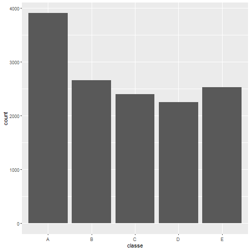
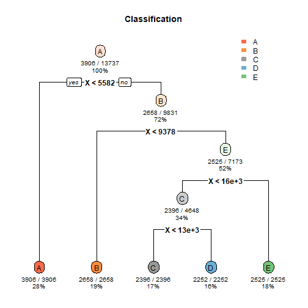

<br>
**<font size="5">Summary</font>**
<br>
Using devices such as Jawbone Up, Nike FuelBand, and Fitbit it is now possible to collect a large amount of data about personal activity relatively inexpensively. These type of devices are part of the quantified self movement - a group of enthusiasts who take measurements about themselves regularly to improve their health, to find patterns in their behavior, or because they are tech geeks. One thing that people regularly do is quantify how much of a particular activity they do, but they rarely quantify how well they do it. In this project, your goal will be to use data from accelerometers on the belt, forearm, arm, and dumbell of 6 participants. They were asked to perform barbell lifts correctly and incorrectly in 5 different ways. More information is available from the website here: http://web.archive.org/web/20161224072740/http:/groupware.les.inf.puc-rio.br/har
<br>

**<font size="5">Cross Validation</font>**
<br>
Cross-validation will be performed by subsampling our training data set randomly without replacement into 2 subsamples:Training data (70% ) and Test data (30%). Our models will be fitted on the TrainTrainingSet data set, and tested on the TestTrainingSet data. Once the most accurate model is choosen, it will be tested on the original Testing data set.
<br>

**<font size="5">Loading and Analysis of dataset</font>**

```r
library(dplyr)
library(ggplot2)
library(caTools)
library(rpart)
library(caret)
library(randomForest)
library(rpart.plot)
training <- read.csv('pml-training.csv',na.strings=c("NA","#DIV/0!", ""))
testing <- read.csv('pml-testing.csv',na.strings=c("NA","#DIV/0!", ""))
summary(training)
```

```
##        X            user_name    raw_timestamp_part_1
##  Min.   :    1   adelmo  :3892   Min.   :1.322e+09   
##  1st Qu.: 4906   carlitos:3112   1st Qu.:1.323e+09   
##  Median : 9812   charles :3536   Median :1.323e+09   
##  Mean   : 9812   eurico  :3070   Mean   :1.323e+09   
##  3rd Qu.:14717   jeremy  :3402   3rd Qu.:1.323e+09   
##  Max.   :19622   pedro   :2610   Max.   :1.323e+09   
##  raw_timestamp_part_2          cvtd_timestamp  new_window 
##  Min.   :   294       28/11/2011 14:14: 1498   no :19216  
##  1st Qu.:252912       05/12/2011 11:24: 1497   yes:  406  
##  Median :496380       30/11/2011 17:11: 1440              
##  Mean   :500656       05/12/2011 11:25: 1425              
##  3rd Qu.:751891       02/12/2011 14:57: 1380              
##  Max.   :998801       02/12/2011 13:34: 1375              
##    num_window      roll_belt        pitch_belt      
##  Min.   :  1.0   Min.   :-28.90   Min.   :-55.8000  
##  1st Qu.:222.0   1st Qu.:  1.10   1st Qu.:  1.7600  
##  Median :424.0   Median :113.00   Median :  5.2800  
##  Mean   :430.6   Mean   : 64.41   Mean   :  0.3053  
##  3rd Qu.:644.0   3rd Qu.:123.00   3rd Qu.: 14.9000  
##  Max.   :864.0   Max.   :162.00   Max.   : 60.3000  
##     yaw_belt       total_accel_belt kurtosis_roll_belt
##  Min.   :-180.00   Min.   : 0.00    Min.   :-2.121    
##  1st Qu.: -88.30   1st Qu.: 3.00    1st Qu.:-1.329    
##  Median : -13.00   Median :17.00    Median :-0.899    
##  Mean   : -11.21   Mean   :11.31    Mean   :-0.220    
##  3rd Qu.:  12.90   3rd Qu.:18.00    3rd Qu.:-0.219    
##  Max.   : 179.00   Max.   :29.00    Max.   :33.000    
##  kurtosis_picth_belt kurtosis_yaw_belt skewness_roll_belt
##  Min.   :-2.190      Mode:logical      Min.   :-5.745    
##  1st Qu.:-1.107      NA's:19622        1st Qu.:-0.444    
##  Median :-0.151                        Median : 0.000    
##  Mean   : 4.334                        Mean   :-0.026    
##  3rd Qu.: 3.178                        3rd Qu.: 0.417    
##  Max.   :58.000                        Max.   : 3.595    
##  skewness_roll_belt.1 skewness_yaw_belt max_roll_belt    
##  Min.   :-7.616       Mode:logical      Min.   :-94.300  
##  1st Qu.:-1.114       NA's:19622        1st Qu.:-88.000  
##  Median :-0.068                         Median : -5.100  
##  Mean   :-0.296                         Mean   : -6.667  
##  3rd Qu.: 0.661                         3rd Qu.: 18.500  
##  Max.   : 7.348                         Max.   :180.000  
##  max_picth_belt   max_yaw_belt   min_roll_belt    
##  Min.   : 3.00   Min.   :-2.10   Min.   :-180.00  
##  1st Qu.: 5.00   1st Qu.:-1.30   1st Qu.: -88.40  
##  Median :18.00   Median :-0.90   Median :  -7.85  
##  Mean   :12.92   Mean   :-0.22   Mean   : -10.44  
##  3rd Qu.:19.00   3rd Qu.:-0.20   3rd Qu.:   9.05  
##  Max.   :30.00   Max.   :33.00   Max.   : 173.00  
##  min_pitch_belt   min_yaw_belt   amplitude_roll_belt
##  Min.   : 0.00   Min.   :-2.10   Min.   :  0.000    
##  1st Qu.: 3.00   1st Qu.:-1.30   1st Qu.:  0.300    
##  Median :16.00   Median :-0.90   Median :  1.000    
##  Mean   :10.76   Mean   :-0.22   Mean   :  3.769    
##  3rd Qu.:17.00   3rd Qu.:-0.20   3rd Qu.:  2.083    
##  Max.   :23.00   Max.   :33.00   Max.   :360.000    
##  amplitude_pitch_belt amplitude_yaw_belt
##  Min.   : 0.000       Min.   :0         
##  1st Qu.: 1.000       1st Qu.:0         
##  Median : 1.000       Median :0         
##  Mean   : 2.167       Mean   :0         
##  3rd Qu.: 2.000       3rd Qu.:0         
##  Max.   :12.000       Max.   :0         
##  var_total_accel_belt avg_roll_belt    stddev_roll_belt
##  Min.   : 0.000       Min.   :-27.40   Min.   : 0.000  
##  1st Qu.: 0.100       1st Qu.:  1.10   1st Qu.: 0.200  
##  Median : 0.200       Median :116.35   Median : 0.400  
##  Mean   : 0.926       Mean   : 68.06   Mean   : 1.337  
##  3rd Qu.: 0.300       3rd Qu.:123.38   3rd Qu.: 0.700  
##  Max.   :16.500       Max.   :157.40   Max.   :14.200  
##  var_roll_belt     avg_pitch_belt    stddev_pitch_belt
##  Min.   :  0.000   Min.   :-51.400   Min.   :0.000    
##  1st Qu.:  0.000   1st Qu.:  2.025   1st Qu.:0.200    
##  Median :  0.100   Median :  5.200   Median :0.400    
##  Mean   :  7.699   Mean   :  0.520   Mean   :0.603    
##  3rd Qu.:  0.500   3rd Qu.: 15.775   3rd Qu.:0.700    
##  Max.   :200.700   Max.   : 59.700   Max.   :4.000    
##  var_pitch_belt    avg_yaw_belt      stddev_yaw_belt  
##  Min.   : 0.000   Min.   :-138.300   Min.   :  0.000  
##  1st Qu.: 0.000   1st Qu.: -88.175   1st Qu.:  0.100  
##  Median : 0.100   Median :  -6.550   Median :  0.300  
##  Mean   : 0.766   Mean   :  -8.831   Mean   :  1.341  
##  3rd Qu.: 0.500   3rd Qu.:  14.125   3rd Qu.:  0.700  
##  Max.   :16.200   Max.   : 173.500   Max.   :176.600  
##   var_yaw_belt        gyros_belt_x        gyros_belt_y     
##  Min.   :    0.000   Min.   :-1.040000   Min.   :-0.64000  
##  1st Qu.:    0.010   1st Qu.:-0.030000   1st Qu.: 0.00000  
##  Median :    0.090   Median : 0.030000   Median : 0.02000  
##  Mean   :  107.487   Mean   :-0.005592   Mean   : 0.03959  
##  3rd Qu.:    0.475   3rd Qu.: 0.110000   3rd Qu.: 0.11000  
##  Max.   :31183.240   Max.   : 2.220000   Max.   : 0.64000  
##   gyros_belt_z      accel_belt_x       accel_belt_y   
##  Min.   :-1.4600   Min.   :-120.000   Min.   :-69.00  
##  1st Qu.:-0.2000   1st Qu.: -21.000   1st Qu.:  3.00  
##  Median :-0.1000   Median : -15.000   Median : 35.00  
##  Mean   :-0.1305   Mean   :  -5.595   Mean   : 30.15  
##  3rd Qu.:-0.0200   3rd Qu.:  -5.000   3rd Qu.: 61.00  
##  Max.   : 1.6200   Max.   :  85.000   Max.   :164.00  
##   accel_belt_z     magnet_belt_x   magnet_belt_y  
##  Min.   :-275.00   Min.   :-52.0   Min.   :354.0  
##  1st Qu.:-162.00   1st Qu.:  9.0   1st Qu.:581.0  
##  Median :-152.00   Median : 35.0   Median :601.0  
##  Mean   : -72.59   Mean   : 55.6   Mean   :593.7  
##  3rd Qu.:  27.00   3rd Qu.: 59.0   3rd Qu.:610.0  
##  Max.   : 105.00   Max.   :485.0   Max.   :673.0  
##  magnet_belt_z       roll_arm         pitch_arm      
##  Min.   :-623.0   Min.   :-180.00   Min.   :-88.800  
##  1st Qu.:-375.0   1st Qu.: -31.77   1st Qu.:-25.900  
##  Median :-320.0   Median :   0.00   Median :  0.000  
##  Mean   :-345.5   Mean   :  17.83   Mean   : -4.612  
##  3rd Qu.:-306.0   3rd Qu.:  77.30   3rd Qu.: 11.200  
##  Max.   : 293.0   Max.   : 180.00   Max.   : 88.500  
##     yaw_arm          total_accel_arm var_accel_arm   
##  Min.   :-180.0000   Min.   : 1.00   Min.   :  0.00  
##  1st Qu.: -43.1000   1st Qu.:17.00   1st Qu.:  9.03  
##  Median :   0.0000   Median :27.00   Median : 40.61  
##  Mean   :  -0.6188   Mean   :25.51   Mean   : 53.23  
##  3rd Qu.:  45.8750   3rd Qu.:33.00   3rd Qu.: 75.62  
##  Max.   : 180.0000   Max.   :66.00   Max.   :331.70  
##   avg_roll_arm     stddev_roll_arm    var_roll_arm      
##  Min.   :-166.67   Min.   :  0.000   Min.   :    0.000  
##  1st Qu.: -38.37   1st Qu.:  1.376   1st Qu.:    1.898  
##  Median :   0.00   Median :  5.702   Median :   32.517  
##  Mean   :  12.68   Mean   : 11.201   Mean   :  417.264  
##  3rd Qu.:  76.33   3rd Qu.: 14.921   3rd Qu.:  222.647  
##  Max.   : 163.33   Max.   :161.964   Max.   :26232.208  
##  avg_pitch_arm     stddev_pitch_arm var_pitch_arm     
##  Min.   :-81.773   Min.   : 0.000   Min.   :   0.000  
##  1st Qu.:-22.770   1st Qu.: 1.642   1st Qu.:   2.697  
##  Median :  0.000   Median : 8.133   Median :  66.146  
##  Mean   : -4.901   Mean   :10.383   Mean   : 195.864  
##  3rd Qu.:  8.277   3rd Qu.:16.327   3rd Qu.: 266.576  
##  Max.   : 75.659   Max.   :43.412   Max.   :1884.565  
##   avg_yaw_arm       stddev_yaw_arm     var_yaw_arm       
##  Min.   :-173.440   Min.   :  0.000   Min.   :    0.000  
##  1st Qu.: -29.198   1st Qu.:  2.577   1st Qu.:    6.642  
##  Median :   0.000   Median : 16.682   Median :  278.309  
##  Mean   :   2.359   Mean   : 22.270   Mean   : 1055.933  
##  3rd Qu.:  38.185   3rd Qu.: 35.984   3rd Qu.: 1294.850  
##  Max.   : 152.000   Max.   :177.044   Max.   :31344.568  
##   gyros_arm_x        gyros_arm_y       gyros_arm_z     
##  Min.   :-6.37000   Min.   :-3.4400   Min.   :-2.3300  
##  1st Qu.:-1.33000   1st Qu.:-0.8000   1st Qu.:-0.0700  
##  Median : 0.08000   Median :-0.2400   Median : 0.2300  
##  Mean   : 0.04277   Mean   :-0.2571   Mean   : 0.2695  
##  3rd Qu.: 1.57000   3rd Qu.: 0.1400   3rd Qu.: 0.7200  
##  Max.   : 4.87000   Max.   : 2.8400   Max.   : 3.0200  
##   accel_arm_x       accel_arm_y      accel_arm_z     
##  Min.   :-404.00   Min.   :-318.0   Min.   :-636.00  
##  1st Qu.:-242.00   1st Qu.: -54.0   1st Qu.:-143.00  
##  Median : -44.00   Median :  14.0   Median : -47.00  
##  Mean   : -60.24   Mean   :  32.6   Mean   : -71.25  
##  3rd Qu.:  84.00   3rd Qu.: 139.0   3rd Qu.:  23.00  
##  Max.   : 437.00   Max.   : 308.0   Max.   : 292.00  
##   magnet_arm_x     magnet_arm_y     magnet_arm_z   
##  Min.   :-584.0   Min.   :-392.0   Min.   :-597.0  
##  1st Qu.:-300.0   1st Qu.:  -9.0   1st Qu.: 131.2  
##  Median : 289.0   Median : 202.0   Median : 444.0  
##  Mean   : 191.7   Mean   : 156.6   Mean   : 306.5  
##  3rd Qu.: 637.0   3rd Qu.: 323.0   3rd Qu.: 545.0  
##  Max.   : 782.0   Max.   : 583.0   Max.   : 694.0  
##  kurtosis_roll_arm kurtosis_picth_arm kurtosis_yaw_arm
##  Min.   :-1.809    Min.   :-2.084     Min.   :-2.103  
##  1st Qu.:-1.345    1st Qu.:-1.280     1st Qu.:-1.220  
##  Median :-0.894    Median :-1.010     Median :-0.733  
##  Mean   :-0.366    Mean   :-0.542     Mean   : 0.406  
##  3rd Qu.:-0.038    3rd Qu.:-0.379     3rd Qu.: 0.115  
##  Max.   :21.456    Max.   :19.751     Max.   :56.000  
##  skewness_roll_arm skewness_pitch_arm skewness_yaw_arm
##  Min.   :-2.541    Min.   :-4.565     Min.   :-6.708  
##  1st Qu.:-0.561    1st Qu.:-0.618     1st Qu.:-0.743  
##  Median : 0.040    Median :-0.035     Median :-0.133  
##  Mean   : 0.068    Mean   :-0.065     Mean   :-0.229  
##  3rd Qu.: 0.671    3rd Qu.: 0.454     3rd Qu.: 0.344  
##  Max.   : 4.394    Max.   : 3.043     Max.   : 7.483  
##   max_roll_arm     max_picth_arm       max_yaw_arm   
##  Min.   :-73.100   Min.   :-173.000   Min.   : 4.00  
##  1st Qu.: -0.175   1st Qu.:  -1.975   1st Qu.:29.00  
##  Median :  4.950   Median :  23.250   Median :34.00  
##  Mean   : 11.236   Mean   :  35.751   Mean   :35.46  
##  3rd Qu.: 26.775   3rd Qu.:  95.975   3rd Qu.:41.00  
##  Max.   : 85.500   Max.   : 180.000   Max.   :65.00  
##   min_roll_arm    min_pitch_arm      min_yaw_arm   
##  Min.   :-89.10   Min.   :-180.00   Min.   : 1.00  
##  1st Qu.:-41.98   1st Qu.: -72.62   1st Qu.: 8.00  
##  Median :-22.45   Median : -33.85   Median :13.00  
##  Mean   :-21.22   Mean   : -33.92   Mean   :14.66  
##  3rd Qu.:  0.00   3rd Qu.:   0.00   3rd Qu.:19.00  
##  Max.   : 66.40   Max.   : 152.00   Max.   :38.00  
##  amplitude_roll_arm amplitude_pitch_arm amplitude_yaw_arm
##  Min.   :  0.000    Min.   :  0.000     Min.   : 0.00    
##  1st Qu.:  5.425    1st Qu.:  9.925     1st Qu.:13.00    
##  Median : 28.450    Median : 54.900     Median :22.00    
##  Mean   : 32.452    Mean   : 69.677     Mean   :20.79    
##  3rd Qu.: 50.960    3rd Qu.:115.175     3rd Qu.:28.75    
##  Max.   :119.500    Max.   :360.000     Max.   :52.00    
##  roll_dumbbell     pitch_dumbbell     yaw_dumbbell     
##  Min.   :-153.71   Min.   :-149.59   Min.   :-150.871  
##  1st Qu.: -18.49   1st Qu.: -40.89   1st Qu.: -77.644  
##  Median :  48.17   Median : -20.96   Median :  -3.324  
##  Mean   :  23.84   Mean   : -10.78   Mean   :   1.674  
##  3rd Qu.:  67.61   3rd Qu.:  17.50   3rd Qu.:  79.643  
##  Max.   : 153.55   Max.   : 149.40   Max.   : 154.952  
##  kurtosis_roll_dumbbell kurtosis_picth_dumbbell
##  Min.   :-2.174         Min.   :-2.200         
##  1st Qu.:-0.682         1st Qu.:-0.721         
##  Median :-0.033         Median :-0.133         
##  Mean   : 0.452         Mean   : 0.286         
##  3rd Qu.: 0.940         3rd Qu.: 0.584         
##  Max.   :54.998         Max.   :55.628         
##  kurtosis_yaw_dumbbell skewness_roll_dumbbell
##  Mode:logical          Min.   :-7.384        
##  NA's:19622            1st Qu.:-0.581        
##                        Median :-0.076        
##                        Mean   :-0.115        
##                        3rd Qu.: 0.400        
##                        Max.   : 1.958        
##  skewness_pitch_dumbbell skewness_yaw_dumbbell
##  Min.   :-7.447          Mode:logical         
##  1st Qu.:-0.526          NA's:19622           
##  Median :-0.091                               
##  Mean   :-0.035                               
##  3rd Qu.: 0.505                               
##  Max.   : 3.769                               
##  max_roll_dumbbell max_picth_dumbbell max_yaw_dumbbell
##  Min.   :-70.10    Min.   :-112.90    Min.   :-2.20   
##  1st Qu.:-27.15    1st Qu.: -66.70    1st Qu.:-0.70   
##  Median : 14.85    Median :  40.05    Median : 0.00   
##  Mean   : 13.76    Mean   :  32.75    Mean   : 0.45   
##  3rd Qu.: 50.58    3rd Qu.: 133.22    3rd Qu.: 0.90   
##  Max.   :137.00    Max.   : 155.00    Max.   :55.00   
##  min_roll_dumbbell min_pitch_dumbbell min_yaw_dumbbell
##  Min.   :-149.60   Min.   :-147.00    Min.   :-2.20   
##  1st Qu.: -59.67   1st Qu.: -91.80    1st Qu.:-0.70   
##  Median : -43.55   Median : -66.15    Median : 0.00   
##  Mean   : -41.24   Mean   : -33.18    Mean   : 0.45   
##  3rd Qu.: -25.20   3rd Qu.:  21.20    3rd Qu.: 0.90   
##  Max.   :  73.20   Max.   : 120.90    Max.   :55.00   
##  amplitude_roll_dumbbell amplitude_pitch_dumbbell
##  Min.   :  0.00          Min.   :  0.00          
##  1st Qu.: 14.97          1st Qu.: 17.06          
##  Median : 35.05          Median : 41.73          
##  Mean   : 55.00          Mean   : 65.93          
##  3rd Qu.: 81.04          3rd Qu.: 99.55          
##  Max.   :256.48          Max.   :273.59          
##  amplitude_yaw_dumbbell total_accel_dumbbell
##  Min.   :0              Min.   : 0.00       
##  1st Qu.:0              1st Qu.: 4.00       
##  Median :0              Median :10.00       
##  Mean   :0              Mean   :13.72       
##  3rd Qu.:0              3rd Qu.:19.00       
##  Max.   :0              Max.   :58.00       
##  var_accel_dumbbell avg_roll_dumbbell stddev_roll_dumbbell
##  Min.   :  0.000    Min.   :-128.96   Min.   :  0.000     
##  1st Qu.:  0.378    1st Qu.: -12.33   1st Qu.:  4.639     
##  Median :  1.000    Median :  48.23   Median : 12.204     
##  Mean   :  4.388    Mean   :  23.86   Mean   : 20.761     
##  3rd Qu.:  3.434    3rd Qu.:  64.37   3rd Qu.: 26.356     
##  Max.   :230.428    Max.   : 125.99   Max.   :123.778     
##  var_roll_dumbbell  avg_pitch_dumbbell
##  Min.   :    0.00   Min.   :-70.73    
##  1st Qu.:   21.52   1st Qu.:-42.00    
##  Median :  148.95   Median :-19.91    
##  Mean   : 1020.27   Mean   :-12.33    
##  3rd Qu.:  694.65   3rd Qu.: 13.21    
##  Max.   :15321.01   Max.   : 94.28    
##  stddev_pitch_dumbbell var_pitch_dumbbell
##  Min.   : 0.000        Min.   :   0.00   
##  1st Qu.: 3.482        1st Qu.:  12.12   
##  Median : 8.089        Median :  65.44   
##  Mean   :13.147        Mean   : 350.31   
##  3rd Qu.:19.238        3rd Qu.: 370.11   
##  Max.   :82.680        Max.   :6836.02   
##  avg_yaw_dumbbell   stddev_yaw_dumbbell var_yaw_dumbbell  
##  Min.   :-117.950   Min.   :  0.000     Min.   :    0.00  
##  1st Qu.: -76.696   1st Qu.:  3.885     1st Qu.:   15.09  
##  Median :  -4.505   Median : 10.264     Median :  105.35  
##  Mean   :   0.202   Mean   : 16.647     Mean   :  589.84  
##  3rd Qu.:  71.234   3rd Qu.: 24.674     3rd Qu.:  608.79  
##  Max.   : 134.905   Max.   :107.088     Max.   :11467.91  
##  gyros_dumbbell_x    gyros_dumbbell_y   gyros_dumbbell_z 
##  Min.   :-204.0000   Min.   :-2.10000   Min.   : -2.380  
##  1st Qu.:  -0.0300   1st Qu.:-0.14000   1st Qu.: -0.310  
##  Median :   0.1300   Median : 0.03000   Median : -0.130  
##  Mean   :   0.1611   Mean   : 0.04606   Mean   : -0.129  
##  3rd Qu.:   0.3500   3rd Qu.: 0.21000   3rd Qu.:  0.030  
##  Max.   :   2.2200   Max.   :52.00000   Max.   :317.000  
##  accel_dumbbell_x  accel_dumbbell_y  accel_dumbbell_z 
##  Min.   :-419.00   Min.   :-189.00   Min.   :-334.00  
##  1st Qu.: -50.00   1st Qu.:  -8.00   1st Qu.:-142.00  
##  Median :  -8.00   Median :  41.50   Median :  -1.00  
##  Mean   : -28.62   Mean   :  52.63   Mean   : -38.32  
##  3rd Qu.:  11.00   3rd Qu.: 111.00   3rd Qu.:  38.00  
##  Max.   : 235.00   Max.   : 315.00   Max.   : 318.00  
##  magnet_dumbbell_x magnet_dumbbell_y magnet_dumbbell_z
##  Min.   :-643.0    Min.   :-3600     Min.   :-262.00  
##  1st Qu.:-535.0    1st Qu.:  231     1st Qu.: -45.00  
##  Median :-479.0    Median :  311     Median :  13.00  
##  Mean   :-328.5    Mean   :  221     Mean   :  46.05  
##  3rd Qu.:-304.0    3rd Qu.:  390     3rd Qu.:  95.00  
##  Max.   : 592.0    Max.   :  633     Max.   : 452.00  
##   roll_forearm       pitch_forearm     yaw_forearm     
##  Min.   :-180.0000   Min.   :-72.50   Min.   :-180.00  
##  1st Qu.:  -0.7375   1st Qu.:  0.00   1st Qu.: -68.60  
##  Median :  21.7000   Median :  9.24   Median :   0.00  
##  Mean   :  33.8265   Mean   : 10.71   Mean   :  19.21  
##  3rd Qu.: 140.0000   3rd Qu.: 28.40   3rd Qu.: 110.00  
##  Max.   : 180.0000   Max.   : 89.80   Max.   : 180.00  
##  kurtosis_roll_forearm kurtosis_picth_forearm
##  Min.   :-1.879        Min.   :-2.098        
##  1st Qu.:-1.398        1st Qu.:-1.376        
##  Median :-1.119        Median :-0.890        
##  Mean   :-0.689        Mean   : 0.419        
##  3rd Qu.:-0.618        3rd Qu.: 0.054        
##  Max.   :40.060        Max.   :33.626        
##  kurtosis_yaw_forearm skewness_roll_forearm
##  Mode:logical         Min.   :-2.297       
##  NA's:19622           1st Qu.:-0.402       
##                       Median : 0.003       
##                       Mean   :-0.009       
##                       3rd Qu.: 0.370       
##                       Max.   : 5.856       
##  skewness_pitch_forearm skewness_yaw_forearm
##  Min.   :-5.241         Mode:logical        
##  1st Qu.:-0.881         NA's:19622          
##  Median :-0.156                             
##  Mean   :-0.223                             
##  3rd Qu.: 0.514                             
##  Max.   : 4.464                             
##  max_roll_forearm max_picth_forearm max_yaw_forearm 
##  Min.   :-66.60   Min.   :-151.00   Min.   :-1.900  
##  1st Qu.:  0.00   1st Qu.:   0.00   1st Qu.:-1.400  
##  Median : 26.80   Median : 113.00   Median :-1.100  
##  Mean   : 24.49   Mean   :  81.49   Mean   :-0.689  
##  3rd Qu.: 45.95   3rd Qu.: 174.75   3rd Qu.:-0.600  
##  Max.   : 89.80   Max.   : 180.00   Max.   :40.100  
##  min_roll_forearm  min_pitch_forearm min_yaw_forearm 
##  Min.   :-72.500   Min.   :-180.00   Min.   :-1.900  
##  1st Qu.: -6.075   1st Qu.:-175.00   1st Qu.:-1.400  
##  Median :  0.000   Median : -61.00   Median :-1.100  
##  Mean   : -0.167   Mean   : -57.57   Mean   :-0.689  
##  3rd Qu.: 12.075   3rd Qu.:   0.00   3rd Qu.:-0.600  
##  Max.   : 62.100   Max.   : 167.00   Max.   :40.100  
##  amplitude_roll_forearm amplitude_pitch_forearm
##  Min.   :  0.000        Min.   :  0.0          
##  1st Qu.:  1.125        1st Qu.:  2.0          
##  Median : 17.770        Median : 83.7          
##  Mean   : 24.653        Mean   :139.1          
##  3rd Qu.: 39.875        3rd Qu.:350.0          
##  Max.   :126.000        Max.   :360.0          
##  amplitude_yaw_forearm total_accel_forearm
##  Min.   :0             Min.   :  0.00     
##  1st Qu.:0             1st Qu.: 29.00     
##  Median :0             Median : 36.00     
##  Mean   :0             Mean   : 34.72     
##  3rd Qu.:0             3rd Qu.: 41.00     
##  Max.   :0             Max.   :108.00     
##  var_accel_forearm avg_roll_forearm   stddev_roll_forearm
##  Min.   :  0.000   Min.   :-177.234   Min.   :  0.000    
##  1st Qu.:  6.759   1st Qu.:  -0.909   1st Qu.:  0.428    
##  Median : 21.165   Median :  11.172   Median :  8.030    
##  Mean   : 33.502   Mean   :  33.165   Mean   : 41.986    
##  3rd Qu.: 51.240   3rd Qu.: 107.132   3rd Qu.: 85.373    
##  Max.   :172.606   Max.   : 177.256   Max.   :179.171    
##  var_roll_forearm   avg_pitch_forearm stddev_pitch_forearm
##  Min.   :    0.00   Min.   :-68.17    Min.   : 0.000      
##  1st Qu.:    0.18   1st Qu.:  0.00    1st Qu.: 0.336      
##  Median :   64.48   Median : 12.02    Median : 5.516      
##  Mean   : 5274.10   Mean   : 11.79    Mean   : 7.977      
##  3rd Qu.: 7289.08   3rd Qu.: 28.48    3rd Qu.:12.866      
##  Max.   :32102.24   Max.   : 72.09    Max.   :47.745      
##  var_pitch_forearm  avg_yaw_forearm   stddev_yaw_forearm
##  Min.   :   0.000   Min.   :-155.06   Min.   :  0.000   
##  1st Qu.:   0.113   1st Qu.: -26.26   1st Qu.:  0.524   
##  Median :  30.425   Median :   0.00   Median : 24.743   
##  Mean   : 139.593   Mean   :  18.00   Mean   : 44.854   
##  3rd Qu.: 165.532   3rd Qu.:  85.79   3rd Qu.: 85.817   
##  Max.   :2279.617   Max.   : 169.24   Max.   :197.508   
##  var_yaw_forearm    gyros_forearm_x   gyros_forearm_y    
##  Min.   :    0.00   Min.   :-22.000   Min.   : -7.02000  
##  1st Qu.:    0.27   1st Qu.: -0.220   1st Qu.: -1.46000  
##  Median :  612.21   Median :  0.050   Median :  0.03000  
##  Mean   : 4639.85   Mean   :  0.158   Mean   :  0.07517  
##  3rd Qu.: 7368.41   3rd Qu.:  0.560   3rd Qu.:  1.62000  
##  Max.   :39009.33   Max.   :  3.970   Max.   :311.00000  
##  gyros_forearm_z    accel_forearm_x   accel_forearm_y 
##  Min.   : -8.0900   Min.   :-498.00   Min.   :-632.0  
##  1st Qu.: -0.1800   1st Qu.:-178.00   1st Qu.:  57.0  
##  Median :  0.0800   Median : -57.00   Median : 201.0  
##  Mean   :  0.1512   Mean   : -61.65   Mean   : 163.7  
##  3rd Qu.:  0.4900   3rd Qu.:  76.00   3rd Qu.: 312.0  
##  Max.   :231.0000   Max.   : 477.00   Max.   : 923.0  
##  accel_forearm_z   magnet_forearm_x  magnet_forearm_y
##  Min.   :-446.00   Min.   :-1280.0   Min.   :-896.0  
##  1st Qu.:-182.00   1st Qu.: -616.0   1st Qu.:   2.0  
##  Median : -39.00   Median : -378.0   Median : 591.0  
##  Mean   : -55.29   Mean   : -312.6   Mean   : 380.1  
##  3rd Qu.:  26.00   3rd Qu.:  -73.0   3rd Qu.: 737.0  
##  Max.   : 291.00   Max.   :  672.0   Max.   :1480.0  
##  magnet_forearm_z classe  
##  Min.   :-973.0   A:5580  
##  1st Qu.: 191.0   B:3797  
##  Median : 511.0   C:3422  
##  Mean   : 393.6   D:3216  
##  3rd Qu.: 653.0   E:3607  
##  Max.   :1090.0           
##  [ reached getOption("max.print") -- omitted 1 row ]
```

```r
summary(testing)
```

```
##        X            user_name raw_timestamp_part_1
##  Min.   : 1.00   adelmo  :1   Min.   :1.322e+09   
##  1st Qu.: 5.75   carlitos:3   1st Qu.:1.323e+09   
##  Median :10.50   charles :1   Median :1.323e+09   
##  Mean   :10.50   eurico  :4   Mean   :1.323e+09   
##  3rd Qu.:15.25   jeremy  :8   3rd Qu.:1.323e+09   
##  Max.   :20.00   pedro   :3   Max.   :1.323e+09   
##  raw_timestamp_part_2          cvtd_timestamp new_window
##  Min.   : 36553       30/11/2011 17:11:4      no:20     
##  1st Qu.:268655       05/12/2011 11:24:3                
##  Median :530706       30/11/2011 17:12:3                
##  Mean   :512167       05/12/2011 14:23:2                
##  3rd Qu.:787738       28/11/2011 14:14:2                
##  Max.   :920315       02/12/2011 13:33:1                
##    num_window      roll_belt          pitch_belt     
##  Min.   : 48.0   Min.   : -5.9200   Min.   :-41.600  
##  1st Qu.:250.0   1st Qu.:  0.9075   1st Qu.:  3.013  
##  Median :384.5   Median :  1.1100   Median :  4.655  
##  Mean   :379.6   Mean   : 31.3055   Mean   :  5.824  
##  3rd Qu.:467.0   3rd Qu.: 32.5050   3rd Qu.:  6.135  
##  Max.   :859.0   Max.   :129.0000   Max.   : 27.800  
##     yaw_belt      total_accel_belt kurtosis_roll_belt
##  Min.   :-93.70   Min.   : 2.00    Mode:logical      
##  1st Qu.:-88.62   1st Qu.: 3.00    NA's:20           
##  Median :-87.85   Median : 4.00                      
##  Mean   :-59.30   Mean   : 7.55                      
##  3rd Qu.:-63.50   3rd Qu.: 8.00                      
##  Max.   :162.00   Max.   :21.00                      
##  kurtosis_picth_belt kurtosis_yaw_belt skewness_roll_belt
##  Mode:logical        Mode:logical      Mode:logical      
##  NA's:20             NA's:20           NA's:20           
##                                                          
##                                                          
##                                                          
##                                                          
##  skewness_roll_belt.1 skewness_yaw_belt max_roll_belt 
##  Mode:logical         Mode:logical      Mode:logical  
##  NA's:20              NA's:20           NA's:20       
##                                                       
##                                                       
##                                                       
##                                                       
##  max_picth_belt max_yaw_belt   min_roll_belt 
##  Mode:logical   Mode:logical   Mode:logical  
##  NA's:20        NA's:20        NA's:20       
##                                              
##                                              
##                                              
##                                              
##  min_pitch_belt min_yaw_belt   amplitude_roll_belt
##  Mode:logical   Mode:logical   Mode:logical       
##  NA's:20        NA's:20        NA's:20            
##                                                   
##                                                   
##                                                   
##                                                   
##  amplitude_pitch_belt amplitude_yaw_belt
##  Mode:logical         Mode:logical      
##  NA's:20              NA's:20           
##                                         
##                                         
##                                         
##                                         
##  var_total_accel_belt avg_roll_belt  stddev_roll_belt
##  Mode:logical         Mode:logical   Mode:logical    
##  NA's:20              NA's:20        NA's:20         
##                                                      
##                                                      
##                                                      
##                                                      
##  var_roll_belt  avg_pitch_belt stddev_pitch_belt
##  Mode:logical   Mode:logical   Mode:logical     
##  NA's:20        NA's:20        NA's:20          
##                                                 
##                                                 
##                                                 
##                                                 
##  var_pitch_belt avg_yaw_belt   stddev_yaw_belt
##  Mode:logical   Mode:logical   Mode:logical   
##  NA's:20        NA's:20        NA's:20        
##                                               
##                                               
##                                               
##                                               
##  var_yaw_belt    gyros_belt_x     gyros_belt_y   
##  Mode:logical   Min.   :-0.500   Min.   :-0.050  
##  NA's:20        1st Qu.:-0.070   1st Qu.:-0.005  
##                 Median : 0.020   Median : 0.000  
##                 Mean   :-0.045   Mean   : 0.010  
##                 3rd Qu.: 0.070   3rd Qu.: 0.020  
##                 Max.   : 0.240   Max.   : 0.110  
##   gyros_belt_z      accel_belt_x     accel_belt_y   
##  Min.   :-0.4800   Min.   :-48.00   Min.   :-16.00  
##  1st Qu.:-0.1375   1st Qu.:-19.00   1st Qu.:  2.00  
##  Median :-0.0250   Median :-13.00   Median :  4.50  
##  Mean   :-0.1005   Mean   :-13.50   Mean   : 18.35  
##  3rd Qu.: 0.0000   3rd Qu.: -8.75   3rd Qu.: 25.50  
##  Max.   : 0.0500   Max.   : 46.00   Max.   : 72.00  
##   accel_belt_z     magnet_belt_x    magnet_belt_y  
##  Min.   :-187.00   Min.   :-13.00   Min.   :566.0  
##  1st Qu.: -24.00   1st Qu.:  5.50   1st Qu.:578.5  
##  Median :  27.00   Median : 33.50   Median :600.5  
##  Mean   : -17.60   Mean   : 35.15   Mean   :601.5  
##  3rd Qu.:  38.25   3rd Qu.: 46.25   3rd Qu.:631.2  
##  Max.   :  49.00   Max.   :169.00   Max.   :638.0  
##  magnet_belt_z       roll_arm         pitch_arm      
##  Min.   :-426.0   Min.   :-137.00   Min.   :-63.800  
##  1st Qu.:-398.5   1st Qu.:   0.00   1st Qu.: -9.188  
##  Median :-313.5   Median :   0.00   Median :  0.000  
##  Mean   :-346.9   Mean   :  16.42   Mean   : -3.950  
##  3rd Qu.:-305.0   3rd Qu.:  71.53   3rd Qu.:  3.465  
##  Max.   :-291.0   Max.   : 152.00   Max.   : 55.000  
##     yaw_arm        total_accel_arm var_accel_arm 
##  Min.   :-167.00   Min.   : 3.00   Mode:logical  
##  1st Qu.: -60.15   1st Qu.:20.25   NA's:20       
##  Median :   0.00   Median :29.50                 
##  Mean   :  -2.80   Mean   :26.40                 
##  3rd Qu.:  25.50   3rd Qu.:33.25                 
##  Max.   : 178.00   Max.   :44.00                 
##  avg_roll_arm   stddev_roll_arm var_roll_arm  
##  Mode:logical   Mode:logical    Mode:logical  
##  NA's:20        NA's:20         NA's:20       
##                                               
##                                               
##                                               
##                                               
##  avg_pitch_arm  stddev_pitch_arm var_pitch_arm 
##  Mode:logical   Mode:logical     Mode:logical  
##  NA's:20        NA's:20          NA's:20       
##                                                
##                                                
##                                                
##                                                
##  avg_yaw_arm    stddev_yaw_arm var_yaw_arm   
##  Mode:logical   Mode:logical   Mode:logical  
##  NA's:20        NA's:20        NA's:20       
##                                              
##                                              
##                                              
##                                              
##   gyros_arm_x      gyros_arm_y       gyros_arm_z     
##  Min.   :-3.710   Min.   :-2.0900   Min.   :-0.6900  
##  1st Qu.:-0.645   1st Qu.:-0.6350   1st Qu.:-0.1800  
##  Median : 0.020   Median :-0.0400   Median :-0.0250  
##  Mean   : 0.077   Mean   :-0.1595   Mean   : 0.1205  
##  3rd Qu.: 1.248   3rd Qu.: 0.2175   3rd Qu.: 0.5650  
##  Max.   : 3.660   Max.   : 1.8500   Max.   : 1.1300  
##   accel_arm_x      accel_arm_y      accel_arm_z     
##  Min.   :-341.0   Min.   :-65.00   Min.   :-404.00  
##  1st Qu.:-277.0   1st Qu.: 52.25   1st Qu.:-128.50  
##  Median :-194.5   Median :112.00   Median : -83.50  
##  Mean   :-134.6   Mean   :103.10   Mean   : -87.85  
##  3rd Qu.:   5.5   3rd Qu.:168.25   3rd Qu.: -27.25  
##  Max.   : 106.0   Max.   :245.00   Max.   :  93.00  
##   magnet_arm_x      magnet_arm_y     magnet_arm_z   
##  Min.   :-428.00   Min.   :-307.0   Min.   :-499.0  
##  1st Qu.:-373.75   1st Qu.: 205.2   1st Qu.: 403.0  
##  Median :-265.00   Median : 291.0   Median : 476.5  
##  Mean   : -38.95   Mean   : 239.4   Mean   : 369.8  
##  3rd Qu.: 250.50   3rd Qu.: 358.8   3rd Qu.: 517.0  
##  Max.   : 750.00   Max.   : 474.0   Max.   : 633.0  
##  kurtosis_roll_arm kurtosis_picth_arm kurtosis_yaw_arm
##  Mode:logical      Mode:logical       Mode:logical    
##  NA's:20           NA's:20            NA's:20         
##                                                       
##                                                       
##                                                       
##                                                       
##  skewness_roll_arm skewness_pitch_arm skewness_yaw_arm
##  Mode:logical      Mode:logical       Mode:logical    
##  NA's:20           NA's:20            NA's:20         
##                                                       
##                                                       
##                                                       
##                                                       
##  max_roll_arm   max_picth_arm  max_yaw_arm   
##  Mode:logical   Mode:logical   Mode:logical  
##  NA's:20        NA's:20        NA's:20       
##                                              
##                                              
##                                              
##                                              
##  min_roll_arm   min_pitch_arm  min_yaw_arm   
##  Mode:logical   Mode:logical   Mode:logical  
##  NA's:20        NA's:20        NA's:20       
##                                              
##                                              
##                                              
##                                              
##  amplitude_roll_arm amplitude_pitch_arm amplitude_yaw_arm
##  Mode:logical       Mode:logical        Mode:logical     
##  NA's:20            NA's:20             NA's:20          
##                                                          
##                                                          
##                                                          
##                                                          
##  roll_dumbbell      pitch_dumbbell    yaw_dumbbell      
##  Min.   :-111.118   Min.   :-54.97   Min.   :-103.3200  
##  1st Qu.:   7.494   1st Qu.:-51.89   1st Qu.: -75.2809  
##  Median :  50.403   Median :-40.81   Median :  -8.2863  
##  Mean   :  33.760   Mean   :-19.47   Mean   :  -0.9385  
##  3rd Qu.:  58.129   3rd Qu.: 16.12   3rd Qu.:  55.8335  
##  Max.   : 123.984   Max.   : 96.87   Max.   : 132.2337  
##  kurtosis_roll_dumbbell kurtosis_picth_dumbbell
##  Mode:logical           Mode:logical           
##  NA's:20                NA's:20                
##                                                
##                                                
##                                                
##                                                
##  kurtosis_yaw_dumbbell skewness_roll_dumbbell
##  Mode:logical          Mode:logical          
##  NA's:20               NA's:20               
##                                              
##                                              
##                                              
##                                              
##  skewness_pitch_dumbbell skewness_yaw_dumbbell
##  Mode:logical            Mode:logical         
##  NA's:20                 NA's:20              
##                                               
##                                               
##                                               
##                                               
##  max_roll_dumbbell max_picth_dumbbell max_yaw_dumbbell
##  Mode:logical      Mode:logical       Mode:logical    
##  NA's:20           NA's:20            NA's:20         
##                                                       
##                                                       
##                                                       
##                                                       
##  min_roll_dumbbell min_pitch_dumbbell min_yaw_dumbbell
##  Mode:logical      Mode:logical       Mode:logical    
##  NA's:20           NA's:20            NA's:20         
##                                                       
##                                                       
##                                                       
##                                                       
##  amplitude_roll_dumbbell amplitude_pitch_dumbbell
##  Mode:logical            Mode:logical            
##  NA's:20                 NA's:20                 
##                                                  
##                                                  
##                                                  
##                                                  
##  amplitude_yaw_dumbbell total_accel_dumbbell
##  Mode:logical           Min.   : 1.0        
##  NA's:20                1st Qu.: 7.0        
##                         Median :15.5        
##                         Mean   :17.2        
##                         3rd Qu.:29.0        
##                         Max.   :31.0        
##  var_accel_dumbbell avg_roll_dumbbell stddev_roll_dumbbell
##  Mode:logical       Mode:logical      Mode:logical        
##  NA's:20            NA's:20           NA's:20             
##                                                           
##                                                           
##                                                           
##                                                           
##  var_roll_dumbbell avg_pitch_dumbbell stddev_pitch_dumbbell
##  Mode:logical      Mode:logical       Mode:logical         
##  NA's:20           NA's:20            NA's:20              
##                                                            
##                                                            
##                                                            
##                                                            
##  var_pitch_dumbbell avg_yaw_dumbbell stddev_yaw_dumbbell
##  Mode:logical       Mode:logical     Mode:logical       
##  NA's:20            NA's:20          NA's:20            
##                                                         
##                                                         
##                                                         
##                                                         
##  var_yaw_dumbbell gyros_dumbbell_x  gyros_dumbbell_y 
##  Mode:logical     Min.   :-1.0300   Min.   :-1.1100  
##  NA's:20          1st Qu.: 0.1600   1st Qu.:-0.2100  
##                   Median : 0.3600   Median : 0.0150  
##                   Mean   : 0.2690   Mean   : 0.0605  
##                   3rd Qu.: 0.4625   3rd Qu.: 0.1450  
##                   Max.   : 1.0600   Max.   : 1.9100  
##  gyros_dumbbell_z accel_dumbbell_x  accel_dumbbell_y
##  Min.   :-1.180   Min.   :-159.00   Min.   :-30.00  
##  1st Qu.:-0.485   1st Qu.:-140.25   1st Qu.:  5.75  
##  Median :-0.280   Median : -19.00   Median : 71.50  
##  Mean   :-0.266   Mean   : -47.60   Mean   : 70.55  
##  3rd Qu.:-0.165   3rd Qu.:  15.75   3rd Qu.:151.25  
##  Max.   : 1.100   Max.   : 185.00   Max.   :166.00  
##  accel_dumbbell_z magnet_dumbbell_x magnet_dumbbell_y
##  Min.   :-221.0   Min.   :-576.0    Min.   :-558.0   
##  1st Qu.:-192.2   1st Qu.:-528.0    1st Qu.: 259.5   
##  Median :  -3.0   Median :-508.5    Median : 316.0   
##  Mean   : -60.0   Mean   :-304.2    Mean   : 189.3   
##  3rd Qu.:  76.5   3rd Qu.:-317.0    3rd Qu.: 348.2   
##  Max.   : 100.0   Max.   : 523.0    Max.   : 403.0   
##  magnet_dumbbell_z  roll_forearm     pitch_forearm    
##  Min.   :-164.00   Min.   :-176.00   Min.   :-63.500  
##  1st Qu.: -33.00   1st Qu.: -40.25   1st Qu.:-11.457  
##  Median :  49.50   Median :  94.20   Median :  8.830  
##  Mean   :  71.40   Mean   :  38.66   Mean   :  7.099  
##  3rd Qu.:  96.25   3rd Qu.: 143.25   3rd Qu.: 28.500  
##  Max.   : 368.00   Max.   : 176.00   Max.   : 59.300  
##   yaw_forearm       kurtosis_roll_forearm
##  Min.   :-168.000   Mode:logical         
##  1st Qu.: -93.375   NA's:20              
##  Median : -19.250                        
##  Mean   :   2.195                        
##  3rd Qu.: 104.500                        
##  Max.   : 159.000                        
##  kurtosis_picth_forearm kurtosis_yaw_forearm
##  Mode:logical           Mode:logical        
##  NA's:20                NA's:20             
##                                             
##                                             
##                                             
##                                             
##  skewness_roll_forearm skewness_pitch_forearm
##  Mode:logical          Mode:logical          
##  NA's:20               NA's:20               
##                                              
##                                              
##                                              
##                                              
##  skewness_yaw_forearm max_roll_forearm max_picth_forearm
##  Mode:logical         Mode:logical     Mode:logical     
##  NA's:20              NA's:20          NA's:20          
##                                                         
##                                                         
##                                                         
##                                                         
##  max_yaw_forearm min_roll_forearm min_pitch_forearm
##  Mode:logical    Mode:logical     Mode:logical     
##  NA's:20         NA's:20          NA's:20          
##                                                    
##                                                    
##                                                    
##                                                    
##  min_yaw_forearm amplitude_roll_forearm
##  Mode:logical    Mode:logical          
##  NA's:20         NA's:20               
##                                        
##                                        
##                                        
##                                        
##  amplitude_pitch_forearm amplitude_yaw_forearm
##  Mode:logical            Mode:logical         
##  NA's:20                 NA's:20              
##                                               
##                                               
##                                               
##                                               
##  total_accel_forearm var_accel_forearm avg_roll_forearm
##  Min.   :21.00       Mode:logical      Mode:logical    
##  1st Qu.:24.00       NA's:20           NA's:20         
##  Median :32.50                                         
##  Mean   :32.05                                         
##  3rd Qu.:36.75                                         
##  Max.   :47.00                                         
##  stddev_roll_forearm var_roll_forearm avg_pitch_forearm
##  Mode:logical        Mode:logical     Mode:logical     
##  NA's:20             NA's:20          NA's:20          
##                                                        
##                                                        
##                                                        
##                                                        
##  stddev_pitch_forearm var_pitch_forearm avg_yaw_forearm
##  Mode:logical         Mode:logical      Mode:logical   
##  NA's:20              NA's:20           NA's:20        
##                                                        
##                                                        
##                                                        
##                                                        
##  stddev_yaw_forearm var_yaw_forearm gyros_forearm_x  
##  Mode:logical       Mode:logical    Min.   :-1.0600  
##  NA's:20            NA's:20         1st Qu.:-0.5850  
##                                     Median : 0.0200  
##                                     Mean   :-0.0200  
##                                     3rd Qu.: 0.2925  
##                                     Max.   : 1.3800  
##  gyros_forearm_y   gyros_forearm_z   accel_forearm_x 
##  Min.   :-5.9700   Min.   :-1.2600   Min.   :-212.0  
##  1st Qu.:-1.2875   1st Qu.:-0.0975   1st Qu.:-114.8  
##  Median : 0.0350   Median : 0.2300   Median :  86.0  
##  Mean   :-0.0415   Mean   : 0.2610   Mean   :  38.8  
##  3rd Qu.: 2.0475   3rd Qu.: 0.7625   3rd Qu.: 166.2  
##  Max.   : 4.2600   Max.   : 1.8000   Max.   : 232.0  
##  accel_forearm_y  accel_forearm_z  magnet_forearm_x
##  Min.   :-331.0   Min.   :-282.0   Min.   :-714.0  
##  1st Qu.:   8.5   1st Qu.:-199.0   1st Qu.:-427.2  
##  Median : 138.0   Median :-148.5   Median :-189.5  
##  Mean   : 125.3   Mean   : -93.7   Mean   :-159.2  
##  3rd Qu.: 268.0   3rd Qu.: -31.0   3rd Qu.:  41.5  
##  Max.   : 406.0   Max.   : 179.0   Max.   : 532.0  
##  magnet_forearm_y magnet_forearm_z   problem_id   
##  Min.   :-787.0   Min.   :-32.0    Min.   : 1.00  
##  1st Qu.:-328.8   1st Qu.:275.2    1st Qu.: 5.75  
##  Median : 487.0   Median :491.5    Median :10.50  
##  Mean   : 191.8   Mean   :460.2    Mean   :10.50  
##  3rd Qu.: 720.8   3rd Qu.:661.5    3rd Qu.:15.25  
##  Max.   : 800.0   Max.   :884.0    Max.   :20.00  
##  [ reached getOption("max.print") -- omitted 1 row ]
```

```r
any(is.na(training))
```

```
## [1] TRUE
```

```r
training<-training[,colSums(is.na(training)) == 0]
any(is.na(testing))
```

```
## [1] TRUE
```

```r
testing<-testing[,colSums(is.na(testing)) == 0]
sample <- createDataPartition(y=training$classe, p=0.70, list=FALSE)
training_set <- training[sample, ] 
testing_set <- training[-sample, ]
ggplot(data = training_set,aes(classe)) + geom_histogram(stat = "count")
```

```
## Warning: Ignoring unknown parameters: binwidth, bins, pad
```


<br>
**<font size="5">Prediction using Random Forest</font>**

```r
model <- randomForest(classe ~. , data=training_set, method="class")
prediction <- predict(model, testing_set, type = "class")
confusionMatrix(prediction, testing_set$classe)
```

```
## Confusion Matrix and Statistics
## 
##           Reference
## Prediction    A    B    C    D    E
##          A 1674    1    0    0    0
##          B    0 1138    0    0    0
##          C    0    0 1026    0    0
##          D    0    0    0  964    0
##          E    0    0    0    0 1082
## 
## Overall Statistics
##                                      
##                Accuracy : 0.9998     
##                  95% CI : (0.9991, 1)
##     No Information Rate : 0.2845     
##     P-Value [Acc > NIR] : < 2.2e-16  
##                                      
##                   Kappa : 0.9998     
##                                      
##  Mcnemar's Test P-Value : NA         
## 
## Statistics by Class:
## 
##                      Class: A Class: B Class: C Class: D
## Sensitivity            1.0000   0.9991   1.0000   1.0000
## Specificity            0.9998   1.0000   1.0000   1.0000
## Pos Pred Value         0.9994   1.0000   1.0000   1.0000
## Neg Pred Value         1.0000   0.9998   1.0000   1.0000
## Prevalence             0.2845   0.1935   0.1743   0.1638
## Detection Rate         0.2845   0.1934   0.1743   0.1638
## Detection Prevalence   0.2846   0.1934   0.1743   0.1638
## Balanced Accuracy      0.9999   0.9996   1.0000   1.0000
##                      Class: E
## Sensitivity            1.0000
## Specificity            1.0000
## Pos Pred Value         1.0000
## Neg Pred Value         1.0000
## Prevalence             0.1839
## Detection Rate         0.1839
## Detection Prevalence   0.1839
## Balanced Accuracy      1.0000
```
<br>
**<font size="5">Prediction using Decision Tree</font>**

```r
model1 <- rpart(classe ~ ., data=training_set, method="class")
prediction1 <- predict(model1, testing_set, type = "class")
rpart.plot(model1, main="Classification", extra=102, under=TRUE, faclen=0)
```



```r
confusionMatrix(prediction1, testing_set$classe)
```

```
## Confusion Matrix and Statistics
## 
##           Reference
## Prediction    A    B    C    D    E
##          A 1674    1    0    0    0
##          B    0 1138    0    0    0
##          C    0    0 1026    0    0
##          D    0    0    0  963    0
##          E    0    0    0    1 1082
## 
## Overall Statistics
##                                      
##                Accuracy : 0.9997     
##                  95% CI : (0.9988, 1)
##     No Information Rate : 0.2845     
##     P-Value [Acc > NIR] : < 2.2e-16  
##                                      
##                   Kappa : 0.9996     
##                                      
##  Mcnemar's Test P-Value : NA         
## 
## Statistics by Class:
## 
##                      Class: A Class: B Class: C Class: D
## Sensitivity            1.0000   0.9991   1.0000   0.9990
## Specificity            0.9998   1.0000   1.0000   1.0000
## Pos Pred Value         0.9994   1.0000   1.0000   1.0000
## Neg Pred Value         1.0000   0.9998   1.0000   0.9998
## Prevalence             0.2845   0.1935   0.1743   0.1638
## Detection Rate         0.2845   0.1934   0.1743   0.1636
## Detection Prevalence   0.2846   0.1934   0.1743   0.1636
## Balanced Accuracy      0.9999   0.9996   1.0000   0.9995
##                      Class: E
## Sensitivity            1.0000
## Specificity            0.9998
## Pos Pred Value         0.9991
## Neg Pred Value         1.0000
## Prevalence             0.1839
## Detection Rate         0.1839
## Detection Prevalence   0.1840
## Balanced Accuracy      0.9999
```
<br>
**<font size="3">Random Forest will be used for prediction as it has a better accuracy</font>**
<br><br>

```r
levels(testing$cvtd_timestamp)<-levels(training_set$cvtd_timestamp)
levels(testing$new_window) <- levels(training_set$new_window)
final.predict <- predict(model, testing, type="class")
final.predict
```

```
##  1  2  3  4  5  6  7  8  9 10 11 12 13 14 15 16 17 18 19 20 
##  A  A  A  A  A  A  A  A  A  A  A  A  A  A  A  A  A  A  A  A 
## Levels: A B C D E
```
